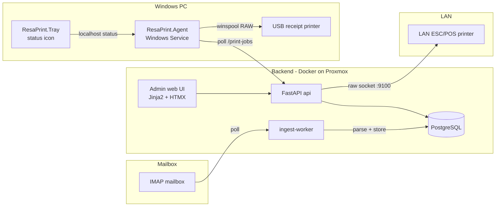

# ResaPrint

Reservation-to-receipt printing for hotel front desks. An IMAP-fed backend
parses reservation emails (format is admin-configurable, not tied to one
hotel or channel) and dispatches print jobs to either a LAN ESC/POS receipt
printer or a Windows PC with a USB receipt printer, via a small always-on
Windows Service ("ResaPrint Agent") and a tray status indicator.

## Architecture



## Quick start

- **Backend deploy on Proxmox (one command)**: this repo is private, so you need a [fine-grained PAT](https://github.com/settings/tokens?type=beta) with `Contents: Read-only` on `griltek/resaprint` first. Then, on the Proxmox host as root —
  ```bash
  GH_TOKEN="<your token>" bash -c "$(curl -fsSL -H "Authorization: token $GH_TOKEN" https://raw.githubusercontent.com/GrilTEK/resaprint/main/proxmox/install-resaprint-lxc.sh)"
  ```
  Creates a new LXC, installs Docker, and starts the stack. See [`proxmox/install-resaprint-lxc.sh`](proxmox/install-resaprint-lxc.sh) for override variables and [`docs/BACKEND.md`](docs/BACKEND.md) for manual `docker compose` deploy, env vars, IMAP setup, and the parser field-mapping guide.
- **Windows client install**: see [`docs/CLIENT.md`](docs/CLIENT.md) — download the release zip, run `install.ps1` as admin, pair the station.
- **API reference**: see [`docs/API.md`](docs/API.md).

## Repository layout

- `backend/` — FastAPI + SQLAlchemy + PostgreSQL backend, admin web UI, email ingestion, printing.
- `client/` — .NET 8 Windows Service (`ResaPrint.Agent`) + tray app (`ResaPrint.Tray`).
- `docs/` — deployment and usage documentation.
- `.github/workflows/` — CI (backend tests, client build/test) and client release packaging.

## License

MIT — see [`LICENSE`](LICENSE).
